# Unidad 2. Arquitectura de redes

- [Unidad 2. Arquitectura de redes](#unidad-2-arquitectura-de-redes)
  - [Introducción](#introducción)
  - [1. El modelo OSI](#1-el-modelo-osi)
    - [1.1. Estructura de Capas](#11-estructura-de-capas)
    - [1.2. Entidades](#12-entidades)
      - [1.2.1. Comunicación Vertical (Servicios entre capas adyacentes)](#121-comunicación-vertical-servicios-entre-capas-adyacentes)
      - [1.2.2. Comunicación Horizontal (Protocolos entre Capas Pares)](#122-comunicación-horizontal-protocolos-entre-capas-pares)
      - [1.2.3 Entidades Pares](#123-entidades-pares)
      - [1.2.4 Protocolos Pares](#124-protocolos-pares)
    - [1.3. Unidades de Información (PDU, SDU, PCI)](#13-unidades-de-información-pdu-sdu-pci)
    - [1.4. Encapsulación y Desencapsulación](#14-encapsulación-y-desencapsulación)
    - [1.5 Sevicios vs. Protocolos](#15-sevicios-vs-protocolos)
    - [1.5.1. Servicios (Comunicación Vertical)](#151-servicios-comunicación-vertical)
    - [1.5.2. Protocolos (Comunicación Horizontal)](#152-protocolos-comunicación-horizontal)
    - [1.6 Las Siete Capas del Modelo OSI](#16-las-siete-capas-del-modelo-osi)
      - [Capa de Aplicación (Nivel 7)](#capa-de-aplicación-nivel-7)
      - [Capa de Presentación (Nivel 6)](#capa-de-presentación-nivel-6)
      - [Capa de Sesión (Nivel 5)](#capa-de-sesión-nivel-5)
      - [Capa de Transporte (Nivel 4)](#capa-de-transporte-nivel-4)
      - [Capa de Red (Nivel 3)](#capa-de-red-nivel-3)
      - [Capa de Enlace de Datos (Nivel 2):](#capa-de-enlace-de-datos-nivel-2)
      - [Capa Física (Nivel 1):](#capa-física-nivel-1)
    - [1.7 Ejemplo enviando un mensaje por Whatsapp](#17-ejemplo-enviando-un-mensaje-por-whatsapp)
  - [2. Arquitectura TCP/IP](#2-arquitectura-tcpip)
    - [2.1. Historia](#21-historia)
    - [2.2 Características](#22-características)
      - [2.2.1. Diseño enfocado en la práctica](#221-diseño-enfocado-en-la-práctica)
      - [2.2.2. Independencia de la Tecnología Subyacente](#222-independencia-de-la-tecnología-subyacente)
      - [2.2.3. Comunicación por Conmutación de Paquetes](#223-comunicación-por-conmutación-de-paquetes)
      - [2.2.4. Protocolos Abiertos y Estandarizados](#224-protocolos-abiertos-y-estandarizados)
      - [2.2.5. Escalabilidad](#225-escalabilidad)
    - [2.3. Limitaciones y Problemáticas](#23-limitaciones-y-problemáticas)
      - [2.3.1. Agotamiento del Espacio de Direcciones IPv4](#231-agotamiento-del-espacio-de-direcciones-ipv4)
      - [2.3.2. Falta de Separación de Responsabilidades entre capas](#232-falta-de-separación-de-responsabilidades-entre-capas)
      - [2.3.3. Seguridad no Integrada Originalmente](#233-seguridad-no-integrada-originalmente)
    - [2.4. Las Cuatro Capas del Modelo TCP/IP](#24-las-cuatro-capas-del-modelo-tcpip)
      - [CAPA 4. CAPA DE APLICACIÓN](#capa-4-capa-de-aplicación)
      - [CAPA 3. CAPA DE TRANSPORTE](#capa-3-capa-de-transporte)
      - [CAPA 2. CAPA DE INTERNET](#capa-2-capa-de-internet)
      - [CAPA 1. CAPA DE ACCESO A LA RED.](#capa-1-capa-de-acceso-a-la-red)
    - [2.5. Comparativa Modelo TCP/IP vs. Modelo OSI](#25-comparativa-modelo-tcpip-vs-modelo-osi)
    - [2.6. Equivalencia de Capas: OSI vs. TCP/IP](#26-equivalencia-de-capas-osi-vs-tcpip)
    - [2.7. Conclusión: La Relevancia Práctica de la Arquitectura TCP/IP](#27-conclusión-la-relevancia-práctica-de-la-arquitectura-tcpip)

## Introducción

Una arquitectura de red es el **diseño o estructura que define cómo se organizan y comunican los componentes de una red informática**. Es como el plano de una casa que indica dónde va cada habitación y cómo se conectan los servicios. Esta arquitectura especifica las reglas, estándares, protocolos y topologías que determinan cómo los dispositivos (ordenadores, routers y switches) se conectan entre sí y cómo transfieren datos dentro de una red.

El objetivo principal de esta arquitectura es **dividir un proceso complejo**, como es la transmisión de datos entre dos estaciones, **en partes más manejables**. Este enfoque modular facilita tanto el diseño como la comprensión de las redes.

Para entender por qué esta división en partes es tan importante, hay que recordar que, a principios de la **década de 1980, el desarrollo de las redes informáticas era un caos**. Cada fabricante creaba sus **propias tecnologías de conexión, que eran propietarias y no compatibles** entre sí. Era como si cada marca de teléfono hablara un idioma diferente y no pudieran llamarse entre sí. Para solucionar este problema de incompatibilidad y desorden, surgieron los modelos de arquitectura de red basados en capas.

Los dos modelos más conocidos son:

*   El **Modelo OSI (Open Systems Interconnection)**: Propuesto por la ISO en 1984, es un **modelo teórico de referencia** que ayuda a entender cómo deberían funcionar las comunicaciones en red. Aunque no es una implementación real de una red, se usa mucho para enseñar y comparar otras arquitecturas. Está dividido en **siete capas**.

*   La **arquitectura TCP/IP (Transmission Control Protocol/Internet Protocol)**: Desarrollada por el Departamento de Defensa de EE.UU. para la red ARPANET, es la **más adoptada en la práctica** y es la base de Internet hoy en día. Surgió como una solución práctica y fue ampliamente adoptada. El 1 de enero de 1983, la adopción de TCP/IP en ARPANET marcó el "nacimiento de Internet". Este modelo se estructura en **cuatro o, según algunas interpretaciones, cinco capas**.

## 1. El modelo OSI

El **Modelo OSI** (Open Systems Interconnection, o Interconexión de Sistemas Abiertos) es un **modelo de referencia teórico** propuesto por la Organización Internacional de Normalización (ISO) en 1977 y publicado en su versión final en 1984.

El objetivo principal del modelo OSI es proporcionar un **marco común** que permita a sistemas de diferentes fabricantes interconectarse y comunicarse de forma óptima, como una especie de "traductor universal".

Aunque el modelo OSI no es una implementación real ni define los protocolos específicos, sí establece un estándar sobre el cual comparar otras arquitecturas y protocolos. Se utiliza ampliamente en la enseñanza para explicar cómo se puede estructurar una "pila" de protocolos de comunicaciones.

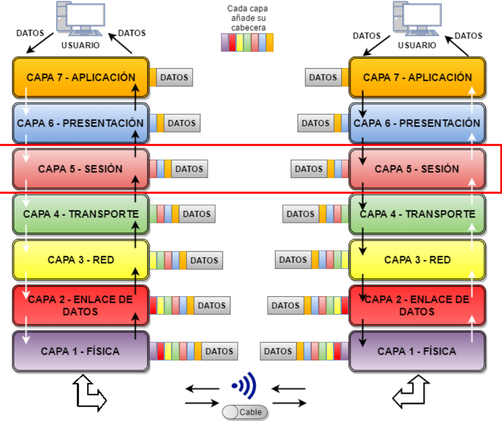{width=800}

### 1.1. Estructura de Capas

El modelo OSI divide el complejo proceso de comunicación en **siete capas o niveles jerárquicos**. La idea principal es aplicar el principio de "divide y vencerás", de modo que cada capa se encarga de resolver un problema específico y más sencillo dentro del proceso de comunicación.

Cada capa **solo interactúa con la capa inmediatamente superior** o inferior. Las capas inferiores **"ofrecen servicios"** o "sirven" a las capas superiores, ocultando los detalles de su implementación. Esto significa que una capa superior solo necesita solicitar un servicio a la inferior sin preocuparse por cómo se lleva a cabo.

Dentro de cada capa, existen **entidades** que son elementos activos del sistema y que intervienen en la comunicación. Dos entidades que pertenecen a la misma capa, pero están en sistemas diferentes (por ejemplo, dos ordenadores), se denominan **entidades pares** y se comunican virtualmente mediante un **protocolo**. Una **interfaz** define qué operaciones y servicios ofrece un nivel al inmediatamente superior.

### 1.2. Entidades
Una capa no es un bloque monolítico y abstracto, sino un nivel funcional habitado por elementos activos que ejecutan tareas específicas. Estos elementos son las **entidades**, los verdaderos protagonistas de la comunicación en red.

En el contexto del modelo OSI, una entidad es el elemento activo dentro de cada capa, implementado ya sea en software, hardware o una combinación de ambos, que implementa las reglas de un protocolo específico para su capa. 

Es la responsable de ejecutar las funciones de dicha capa. Por ejemplo, la entidad de la capa de Sesión es la que establece, administra y finaliza las comunicaciones entre dos sistemas, mientras que la entidad de la capa de Red se encarga del enrutamiento y el direccionamiento lógico.

Dentro de un mismo sistema (por ejemplo, un host emisor), cada capa contiene una o más entidades. Estas entidades se comunican **verticalmente** con las de las capas inmediatamente superior e inferior para prestar y recibir servicios. Sin embargo, la comunicación no es únicamente vertical; el objetivo final es una comunicación lógica y **horizontal** con sus contrapartes en un sistema remoto.

#### 1.2.1. Comunicación Vertical (Servicios entre capas adyacentes)

Dentro de un único sistema (por ejemplo, un ordenador), las capas se comunican de forma vertical. Cada **capa n** proporciona servicios a la **capa superior n+1**. Este modelo de servicio es jerárquico: cada capa depende de las funciones que le ofrece la capa que se encuentra directamente debajo de ella. Por ejemplo, la capa de Enlace de Datos presta un servicio a la capa de Red, y esta, a su vez, a la de Transporte.
Este flujo es el camino **real** (físico) que siguen los datos. En un host emisor (por ejemplo un ordenador), la información desciende a través de las capas, desde la capa de Aplicación hasta la capa Física. En el host receptor, el proceso se invierte y los datos ascienden desde la capa Física hasta que llegan a la aplicación de destino.

#### 1.2.2. Comunicación Horizontal (Protocolos entre Capas Pares)

La comunicación horizontal es la **interacción lógica** que ocurre entre capas iguales (pares u homólogas) en sistemas diferentes, como el origen y el destino. 

Como lo define la normativa: **"La capa n de un computador se comunica con la capa n de otro computador"**. Esta forma de comunicación se conoce como comunicación de par a par.

Es crucial entender que esta comunicación es lógica, no física. Los datos no saltan directamente de la capa de Transporte de un host a la capa de Transporte de otro. En realidad, viajan físicamente por el flujo vertical. La comunicación horizontal se logra gracias a que las entidades pares de ambos sistemas utilizan un conjunto de reglas y convenciones comunes, un protocolo que ambas entienden y respetan. 

  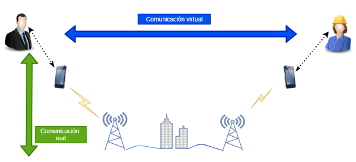

En esencia, la comunicación vertical actúa como el servicio postal que transporta los sobres, mientras que la comunicación horizontal es la conversación lógica contenida en las cartas que las entidades pares se envían entre sí.

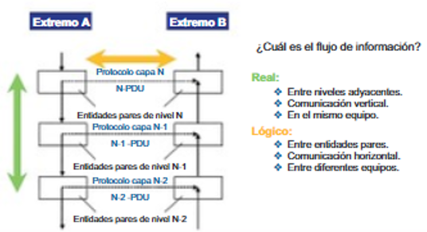

#### 1.2.3 Entidades Pares 

Las entidades pares (o peer entities) son aquellas que residen en la misma capa en los hosts de origen y destino. Por ejemplo, la entidad de la capa de Red en el Host A y la entidad de la capa de Red en el Host B son entidades pares. Su propósito es establecer una comunicación como si estuvieran directamente conectadas, abstrayendo toda la complejidad de las capas inferiores.

#### 1.2.4 Protocolos Pares 

Para que las entidades pares puedan comunicarse, deben "hablar el mismo idioma". Este idioma compartido es lo que se denomina un **protocolo par**. 

Técnicamente, un protocolo es "un conjunto de normas, o un acuerdo, que determina el formato y la transmisión de datos". 

**Las "normas y convenciones que se utilizan en esta comunicación se denominan colectivamente protocolo de la capa n".**

Para hacerlo más accesible, podemos usar analogías. Un protocolo es similar a las reglas de orden que permiten a cientos de representantes debatir en un congreso de forma organizada, o a las reglas específicas que los pilotos obedecen para comunicarse con el control de tráfico aéreo y otros aviones. Sin estas reglas compartidas, la comunicación sería un caos.

### 1.3. Unidades de Información (PDU, SDU, PCI)

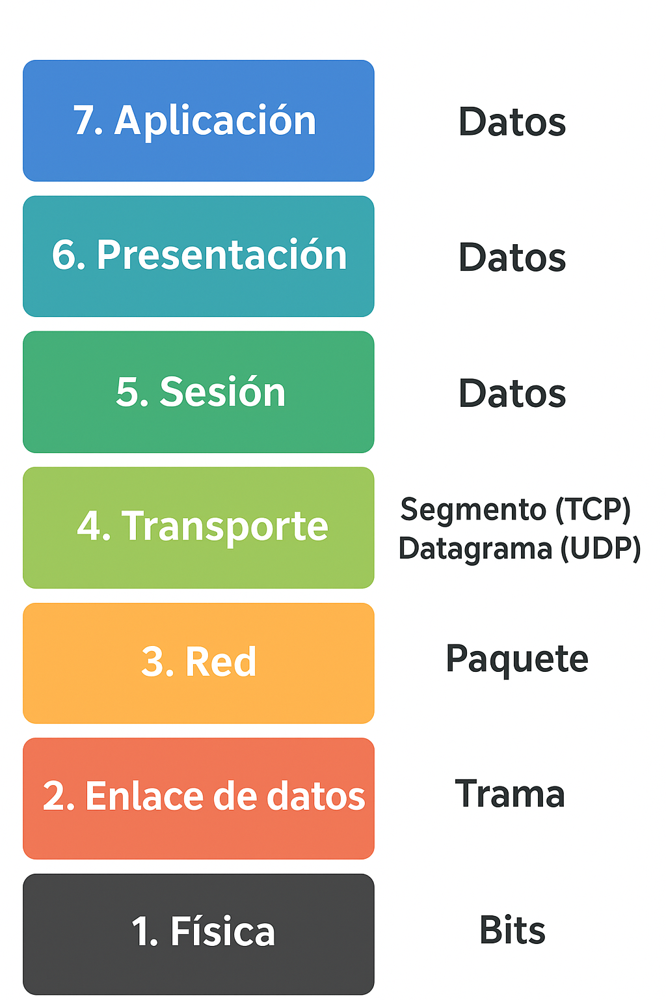{width=300}

Las **entidades pares** intercambian información utilizando Unidades de Datos de Protocolo (PDU). 

Una PDU puede entenderse como el "mensaje" específico que una **capa n** en el origen envía a su **capa n** homóloga en el destino.

Cada capa de comunicación intercambia su PDU específica con su par en el otro sistema. A medida que los datos descienden por las capas, se van encapsulando, y la PDU de cada capa recibe un nombre distintivo.

En la siguiente tabla se muestran los PDU asociados a cada capa del modelo OSI:

| **Capa del modelo OSI** | **Nombre de la PDU**             | **Que nformación contiene el PDU**                                                                             |
| ----------------------- | -------------------------------- | ---------------------------------------------------------------------------------------------------- |
| **7. Aplicación**       | Datos                            | La información tal como la genera o usa la aplicación (correo, web, etc.).                           |
| **6. Presentación**     | Datos                            | Se encarga de la traducción, compresión o cifrado, pero sigue tratándose como datos.                 |
| **5. Sesión**           | Datos                            | Gestiona el diálogo entre aplicaciones, la PDU sigue siendo datos.                                   |
| **4. Transporte**       | Segmento (TCP) / Datagrama (UDP) | Divide los datos en partes más pequeñas para su envío y asegura su entrega o no, según el protocolo. |
| **3. Red**              | Paquete                          | Incluye las direcciones lógicas (ej. IP) para encaminar la información entre redes.                  |
| **2. Enlace de datos**  | Trama                            | Añade direcciones físicas (ej. MAC) y control de errores en la transmisión local.                    |
| **1. Física**           | Bits                             | Representa la información como señales eléctricas, ópticas o de radio (0 y 1).                       |

Para que estas PDUs viajen desde una entidad par a otra, el modelo OSI emplea un ingenioso mecanismo técnico que traduce la comunicación lógica horizontal en una transmisión física vertical.

Cada PDU se compone de dos partes:
*   **SDU (Service Data Unit)**: Son los datos que la capa superior (N+1) le entrega a la capa actual (N) para que realice un servicio.
*   **PCI (Protocol Control Information)**: Es la información de control que la capa actual (N) añade a la SDU, como cabeceras o información final, necesaria para que las entidades pares de esa capa coordinen su operación.

### 1.4. Encapsulación y Desencapsulación

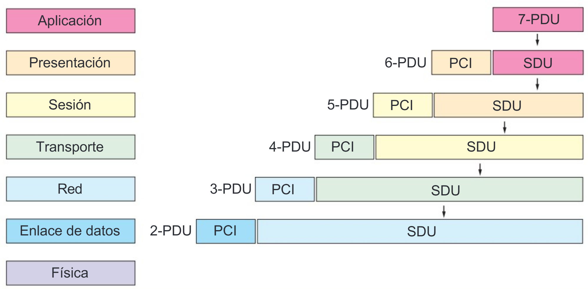{width=600}

El proceso de comunicación en el modelo OSI implica la **encapsulación** de los datos a medida que descienden por las capas del sistema emisor.
1.  Un programa de usuario, en la capa de aplicación (Nivel 7), genera un mensaje o datos.
2.  Esta capa añade su información de control (PCI) a los datos (SDU) para formar su propia PDU (7-PDU).
3.  Esta PDU se convierte en la SDU para la capa inferior (Nivel 6, Presentación), que a su vez le añade su propio PCI para crear la PDU de esa capa (6-PDU).
4.  Este proceso se repite sucesivamente en cada capa descendente (Sesión, Transporte, Red, Enlace de Datos), añadiendo cada una su propia información de control, lo que hace que el tamaño de los datos "engorde" a medida que bajan por la pila.
5.  Finalmente, la capa física (Nivel 1) convierte toda la información en **bits** (señales eléctricas, ópticas o de radio) que son transmitidos a través del medio físico.

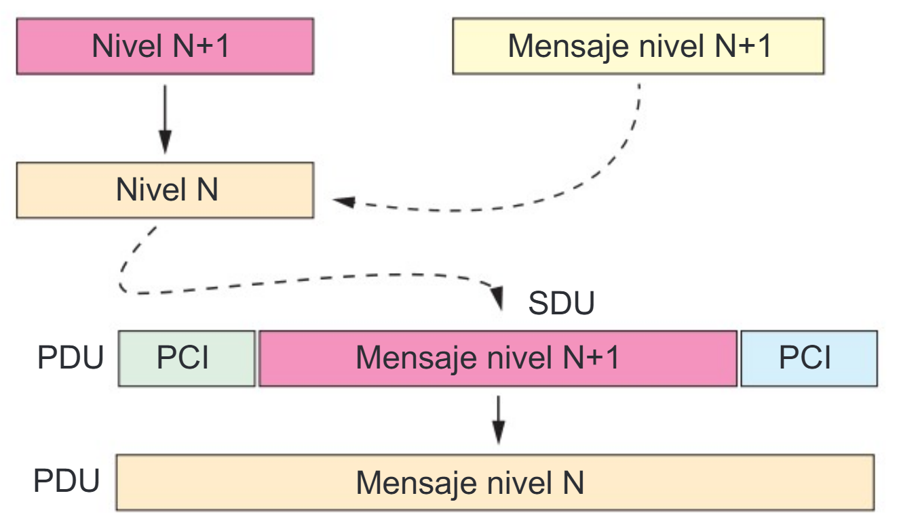{width=400}

En el sistema receptor, ocurre el proceso inverso, llamado **desencapsulación**. A medida que los bits llegan a la capa física del receptor, se van reconstruyendo las PDUs de cada capa. Cada capa lee y retira su información de control (PCI), y pasa los datos "limpios" (SDU) a la capa superior. Este proceso continúa hasta que el mensaje original llega a la aplicación del usuario en la capa de aplicación.

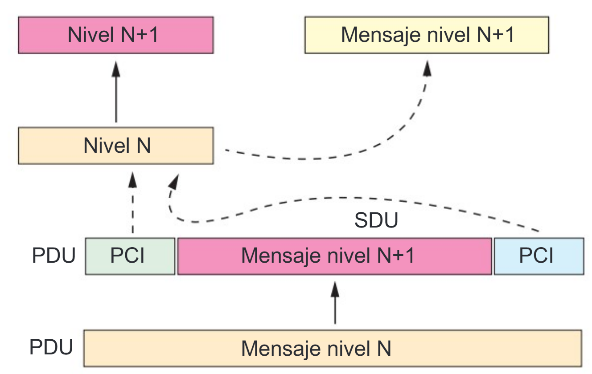{width=400}

En la siguiente imagen se representa como se encapsulan los datos a enviar en el origen de la transmisión y como se desencapsulan los datos en el destino.

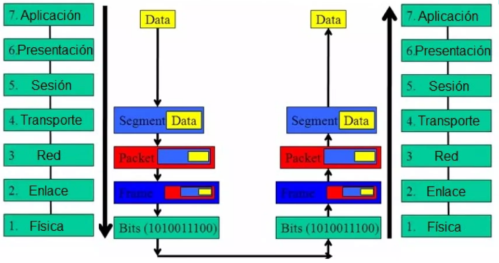{width=800}

### 1.5 Sevicios vs. Protocolos

Para comprender la arquitectura del modelo OSI, es crucial diferenciar entre dos conceptos fundamentales: servicios y protocolos. Estos mecanismos definen cómo se comunican las capas tanto dentro de un mismo sistema como entre sistemas diferentes. Se pueden concebir como los ejes de comunicación vertical y horizontal, respectivamente.

### 1.5.1. Servicios (Comunicación Vertical)
El concepto de "servicio" describe la interacción entre capas adyacentes dentro de un mismo sistema. Cada capa (denominada capa N) proporciona un conjunto de funciones y capacidades a la capa inmediatamente superior (capa N+1). Por ejemplo, la capa de Red ofrece a la capa de Transporte el servicio de enrutar paquetes a través de la red, sin que la capa de Transporte necesite saber qué ruta específica tomarán esos paquetes. Esta es la comunicación vertical: una capa "hablando" hacia arriba o hacia abajo con sus vecinas directas.

### 1.5.2. Protocolos (Comunicación Horizontal)
Un "protocolo" es un conjunto de reglas y convenciones que rigen el intercambio de información entre entidades pares, es decir, la misma capa en dos sistemas diferentes que se están comunicando. La capa N de un computador se comunica con la capa N de otro computador mediante el protocolo de la capa N. 

Por ejemplo, cuando navegas por internet, el protocolo HTTP en la capa de Aplicación de tu navegador se comunica con el protocolo HTTP en la capa de Aplicación del servidor web. Esta comunicación es horizontal, ya que ocurre entre capas iguales (pares) en sistemas distintos.

Para solidificar esta distinción, pensemos en el sistema postal. El servicio es lo que la oficina de correos le ofrece a usted: toma su carta (capa N+1) y se encarga de entregarla (servicio de la capa N). Usted no necesita saber cómo funciona el sistema de camiones y aviones. El protocolo son las reglas que usan las oficinas de correos entre sí para intercambiar sacas de correo, asegurándose de que la dirección de destino sea legible y el franqueo correcto (comunicación horizontal).

La siguiente tabla resume las diferencias clave entre ambos conceptos:

| Concepto   | Tipo de Comunicación | Descripción                                                                 |
|------------|----------------------|------------------------------------------------------------------------------|
| Servicios  | Vertical             | Interacción entre capas adyacentes dentro del mismo sistema.                |
| Protocolos | Horizontal           | Interacción entre capas iguales (pares) en sistemas diferentes.             |

 

### 1.6 Las Siete Capas del Modelo OSI

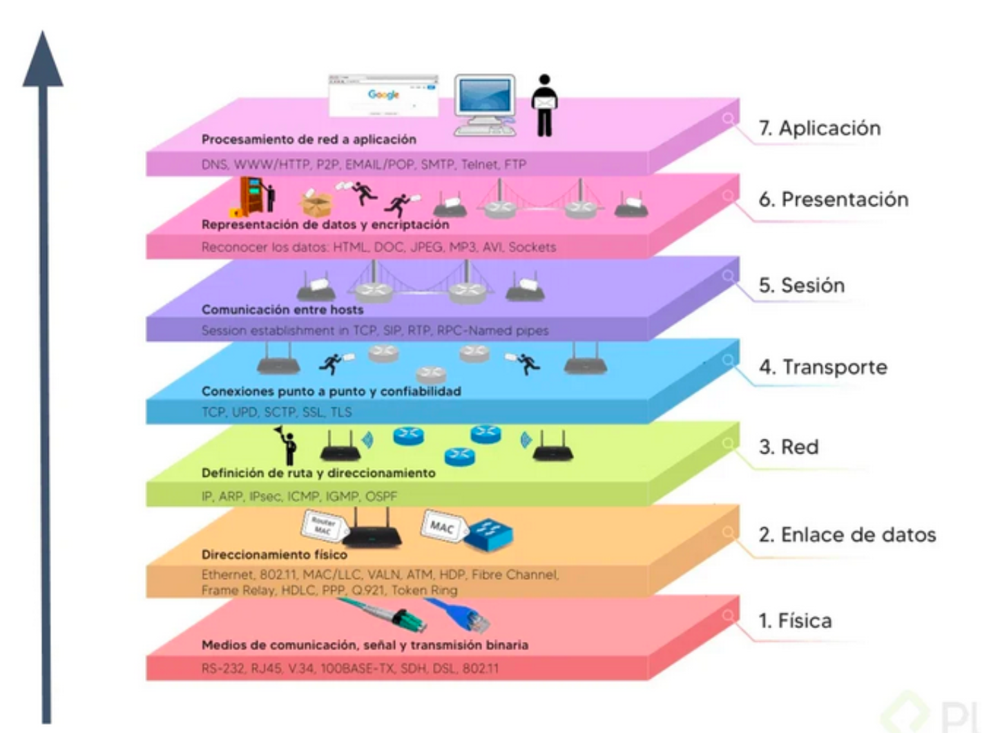{width=900}

Las siete capas del modelo OSI, de arriba hacia abajo, son las siguientes:

#### Capa de Aplicación (Nivel 7)
*   **Función**: Es la capa **más cercana al usuario** y proporciona acceso a los servicios de red a las aplicaciones de usuario. Define los protocolos que utilizan las aplicaciones para intercambiar datos.
  
 

*   **Detalles**: Incluye protocolos para tareas comunes como la **transferencia de ficheros** (FTP), **acceso remoto** (SSH), **transferencia de hipertexto** (HTTP, HTTPS para navegación web), **correo electrónico** (SMTP, POP, IMAP), **resolución de nombres de dominio** (DNS), y otras funciones como la asignación de direcciones (DHCP) o la compartición de impresoras. El usuario normalmente interactúa con programas (navegadores web, clientes de correo) que a su vez interactúan con esta capa, ocultando la complejidad subyacente.

 

*   **Ejemplo (Envío de correo electrónico)**
    En el caso del correo electrónico, la Capa de Aplicación es donde el usuario escribe el mensaje de correo electrónico. Cuando presiona el botón "Enviar", la aplicación cliente de correo interactúa con el protocolo SMTP para iniciar la transferencia. En este punto, los caracteres alfanuméricos del mensaje se convierten en un flujo de datos listo para ser procesado por las capas inferiores.
Una vez que los datos están listos para ser enviados, es necesario darles un formato y una estructura que sean comprensibles para el sistema receptor, una tarea que corresponde a la siguiente capa.

 

#### Capa de Presentación (Nivel 6)

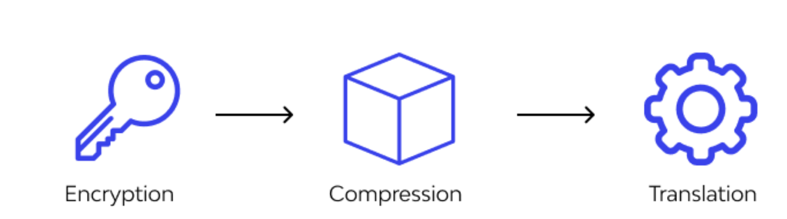{width=500}

*   **Función**: Asegurar que la información enviada por la capa de aplicación de un sistema sea legible y utilizable por la capa de aplicación de otro. Para lograrlo, gestiona las posibles diferencias en la representación de los datos, traduciéndolos a un formato común que ambos sistemas puedan entender.

 

*   **Detalles**: Las responsablidades principales de esta capa son:
    - **Formato y Traducción de Datos:** Su función principal es traducir los datos a un formato común. Esto es crucial porque diferentes arquitecturas de ordenador pueden representar los datos de manera distinta (p. ej., codificación de caracteres como ASCII vs. EBCDIC).
    - **Cifrado y Compresión:** Esta capa también se encarga de tareas cruciales de seguridad y eficiencia. Realiza el cifrado (encriptación) de los datos para garantizar la privacidad y proteger la información durante su tránsito. 
    - **Compresión**: Además, puede realizar la compresión de datos para reducir su tamaño, optimizando así el ancho de banda y la velocidad de la transmisión.

 

*   **Ejemplo (Envío de correo electrónico)**: 
  Al procesar nuestro correo electrónico, la Capa de Presentación toma los datos de la capa superior y podría realizar las siguientes tareas:
    - Asegurar que el formato de los caracteres (por ejemplo, ASCII o Unicode) sea compatible entre el sistema del remitente y el del receptor.
    - **Cifrar** el contenido del mensaje si se está utilizando una conexión segura, protegiendo su confidencialidad.
    - **Comprimir** cualquier archivo adjunto al correo para reducir su tamaño total y acelerar la transferencia.

    Una vez que los datos son comprensibles, seguros y eficientes, es necesario gestionar el diálogo de comunicación entre los dos sistemas, lo que nos introduce a la Capa de Sesión.

 

#### Capa de Sesión (Nivel 5)

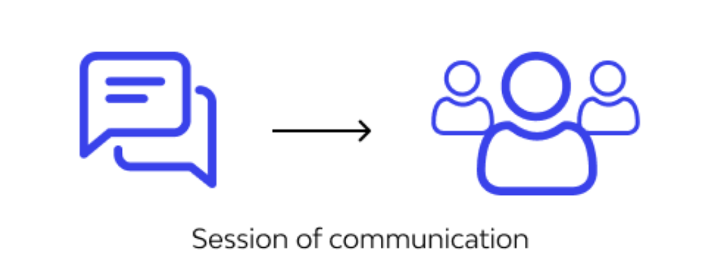{width=450}

*   **Función**:  La Capa de Sesión actúa como la administradora del diálogo entre dos hosts que se comunican. Su función principal es establecer, gestionar y finalizar las conversaciones, conocidas como **"sesiones**"**, entre las aplicaciones de los sistemas de origen y destino.   

 

*   **Detalles**: Las responsablidades principales de esta capa son:
    *   **Establecimiento y Finalización de Sesiones**: Inicia y termina formalmente una conexión de comunicación entre dos aplicaciones, asegurando que ambos extremos estén listos para el intercambio de datos.
    *   **Gestión del Diálogo**: Sincroniza el diálogo entre las capas de presentación de los dos hosts. Controla el intercambio de datos, determinando, por ejemplo, si la comunicación es half-duplex (alterna, un lado transmite a la vez) o full-duplex (bidireccional y simultánea).
    *   **Recuperación:** Ofrece mecanismos para la recuperación de sesiones en caso de fallo. Por ejemplo, si se interrumpe una transferencia de archivos grande, esta capa puede insertar puntos de control (checkpoints) en el flujo de datos. Esto permite que la sesión se reanude desde el último punto de control exitoso en lugar de reiniciar toda la transferencia desde el principio.
  
 

*   **Ejemplo (Envío de correo electrónico)**.
  En el caso de nuestro correo electrónico, la Capa de Sesión es la responsable de establecer y mantener la conexión entre el cliente de correo del remitente y el servidor de correo del destinatario. Se asegura de que el canal de comunicación permanezca abierto durante el tiempo necesario para transferir completamente el mensaje y sus archivos adjuntos.

    Una vez que la sesión está abierta y el diálogo está gestionado, el siguiente paso es asegurar que los datos se transfieran de manera fiable y ordenada, una tarea que recae sobre la Capa de Transporte.

 

#### Capa de Transporte (Nivel 4)

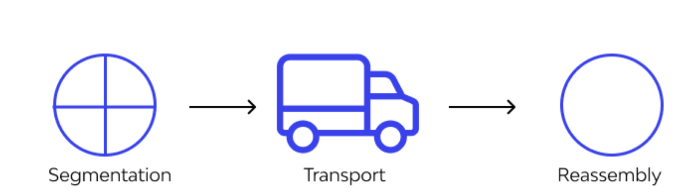{width=500}

*   **Función**: La Capa de Transporte es la responsable de la calidad y **fiabilidad de la comunicación de extremo a extremo**. Su función es tomar los datos de la capa de sesión, dividirlos si es necesario, y asegurar que todas las piezas lleguen correctamente al otro extremo.

 

*   **Detalles**: Esta capa puede realizar varias funciones vitales para garantizar una comunicación de calidad.
    - **Segmentación y Reensamblaje**: Divide los datos provenientes de la capa superior en unidades más pequeñas llamadas **segmentos**. En el host receptor, se encarga de reensamblar estos segmentos en la corriente de datos original.
    - **Control de Flujo**: Gestiona la velocidad de transmisión de datos para evitar que un sistema emisor rápido sature a un sistema receptor más lento, asegurando una comunicación fluida.
    - **Control de Errores**: Proporciona mecanismos para la verificación de la integridad de los datos, garantizando que lleguen sin errores. Si un segmento se pierde o llega corrupto, esta capa puede solicitar su retransmisión.

 

* **Protocolos Clave: TCP y UDP**
Dos de los protocolos más importantes de la Capa de Transporte son TCP y UDP, cada uno con un enfoque diferente para la transmisión de datos. Los veremos más adelante.

 

* **Ejemplo (Envío de correo electrónico)**
  
  Para el envío de un correo electrónico, la fiabilidad es crucial, por lo que se utiliza el protocolo TCP. 
  Imagina que tu largo correo es demasiado grande para caber en un sobre de tamaño estándar. 

  La Capa de Transporte actúa como un empleado de correo que corta la carta en páginas numeradas, coloca cada página en su propio sobre (un segmento) y lleva un registro de cuántos se enviaron para que el destinatario pueda reensamblarlos en el orden correcto y saber si alguno se extravió. Esto garantiza que el destinatario reciba el mensaje íntegro y sin corrupción.

  Ahora que los datos están segmentados y listos para una transferencia fiable, necesitan una dirección para ser enviados a través de la red, lo que nos introduce a la función de la Capa de Red.

 

#### Capa de Red (Nivel 3)
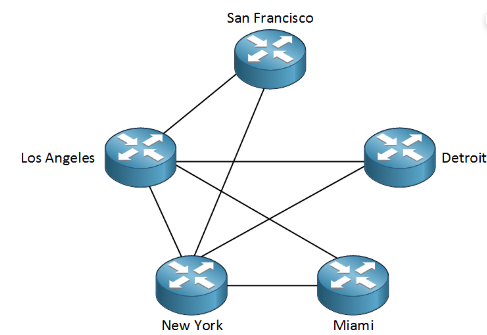{width=500}
*   **Función**: 
La Capa de Red puede ser considerada como el "GPS" de la red. Su función crítica es proporcionar conectividad y selección de ruta (enrutamiento) entre dos sistemas que pueden estar ubicados en redes geográficamente distintas. Crucialmente, esta es la primera capa que se ocupa del enrutamiento de extremo a extremo a través de diferentes redes, mientras que las capas inferiores solo se preocupan por la comunicación en un único enlace de red local.

 

*   **Detalles**: Las cuatro funciones principales de esta capa son esenciales para la comunicación global.

    * **Direccionamiento Lógico**: Utiliza direcciones lógicas, como las direcciones IP (IPv4 e IPv6), para identificar de manera única los dispositivos de origen y destino en la red. A diferencia de las direcciones físicas, las direcciones IP permiten la comunicación entre diferentes redes locales.

    * **Encapsulamiento**: Recibe los segmentos de la Capa de Transporte y les agrega un encabezado de red, que contiene las direcciones IP de origen y destino. Este proceso encapsula el segmento de la Capa de Transporte dentro de una nueva unidad de datos llamada **paquete.**
    
    * **Enrutamiento:** Los dispositivos de esta capa, como los routers, examinan la dirección IP de destino de cada paquete y utilizan tablas de enrutamiento para determinar la mejor ruta o el camino más eficiente para que el paquete viaje a través de la red hasta su destino final.

 

*   **Dispositivos**: Los **routers** (también conocidos como encaminadores o enrutadores) operan en esta capa, conectando diferentes redes y seleccionando la mejor ruta para los paquetes. Algunos switches avanzados pueden operar como routers de capa 3.

 

* **Protocolos**: El protocolo principal de esta capa es el Protocolo de Internet (IP)-

 

* **Ejemplo (Envío de correo electrónico)**
  En nuestro ejemplo, cada segmento del correo electrónico es **encapsulado en un paquete**. 
  
  A cada paquete se le añade un encabezado que contiene la dirección IP del ordenador del remitente y la dirección IP del servidor de correo del destinatario. 
  
  A medida que estos paquetes viajan por Internet, los routers en el camino leerán la dirección IP de destino y los reenviarán por la ruta más adecuada para que lleguen a su destino.
  
  Para que un paquete pueda viajar de un router al siguiente en un enlace de red específico, necesita ser formateado para esa red local. Esta tarea nos lleva a la Capa de Enlace de Datos.

 

#### Capa de Enlace de Datos (Nivel 2):

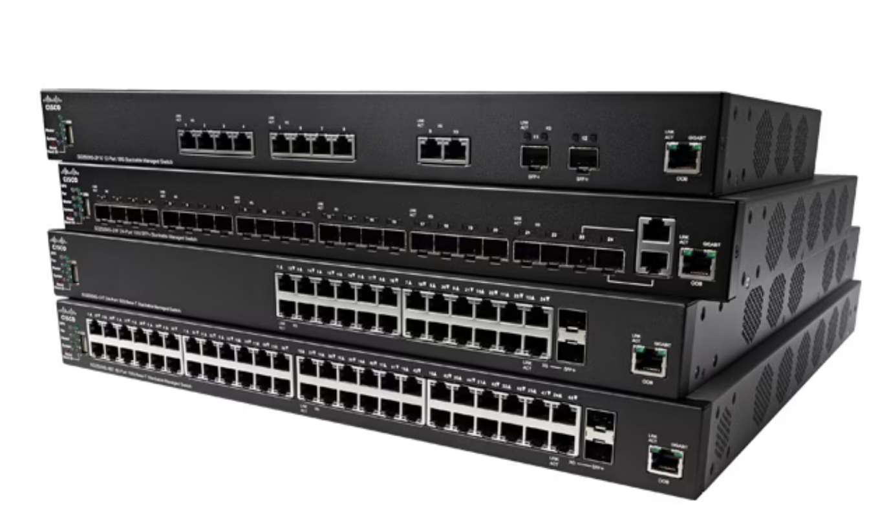{width=500}

*   **Función**: Asegura la **transmisión de datos sin errores** entre dos dispositivos **directamente conectados**. Mientras que la Capa de Red se ocupa del enrutamiento a través de múltiples redes, esta capa se centra en la comunicación entre dispositivos que están en la misma red local (LAN). Agrupa los bits recibidos de la capa física en unidades lógicas llamadas **tramas (frames)**.

 

*   **Detalles**: Esta capa gestiona la comunicación local mediante varias funciones clave.
    * **Direccionamiento Físico**: Utiliza direcciones físicas, conocidas como **direcciones MAC** (Control de Acceso al Medio), que están grabadas en el hardware de la tarjeta de red. A diferencia de las direcciones IP lógicas de la Capa 3, que pueden cambiar según la ubicación en la red, la dirección MAC es un identificador permanente y único de una tarjeta de interfaz de red (NIC) dentro de un segmento local.
    * **Entramado (Framing):** Encapsula los paquetes recibidos de la Capa de Red en unidades de datos llamadas tramas. Este proceso encapsula el paquete de la Capa de Red dentro de una trama, agregando un encabezado (que incluye las direcciones MAC de origen y destino).
    * **Control de Acceso al Medio (MAC):** Gestiona cómo los dispositivos acceden y comparten el medio de red (como un cable Ethernet o el aire en Wi-Fi) para evitar colisiones cuando varios dispositivos intentan transmitir datos simultáneamente.
    * **Detección de Errores:** Esta función se logra típicamente añadiendo un tráiler a la trama, como una Secuencia de Verificación de Trama (FCS), que permite al dispositivo receptor verificar si los datos se han corrompido durante el tránsito. Si bien esta capa detecta errores, la corrección a menudo es gestionada por capas superiores (como la Capa 4) que solicitan una retransmisión.

 

* **Protocolos y dispositivos**: 
  
  Los estándares más comunes que operan en esta capa son:

    - **Ethernet** para redes cableadas y 
    - **Wi-Fi** (802.11) para redes inalámbricas. 
  
    Los dispositivos principales que funcionan en la Capa 2 son los **switches** (conmutadores), que utilizan las direcciones MAC para reenviar las tramas al dispositivo correcto dentro de la red local.

 

* **Ejemplo (Envío de correo electrónico)**
  
  El paquete que contiene un fragmento de nuestro correo electrónico es encapsulado en una trama. Esta trama contiene, además del paquete IP, las direcciones MAC del ordenador del remitente (origen) y del siguiente dispositivo en la ruta, que suele ser el router local (destino). Un switch en la red local leerá esta dirección MAC de destino y reenviará la trama directamente al puerto conectado al router, sin necesidad de enviarla a todos los demás dispositivos de la red.

  Con la trama lista, el último paso en el sistema de origen es convertirla en señales físicas y enviarla a través del medio, una tarea que corresponde a la Capa Física.

 

#### Capa Física (Nivel 1):
  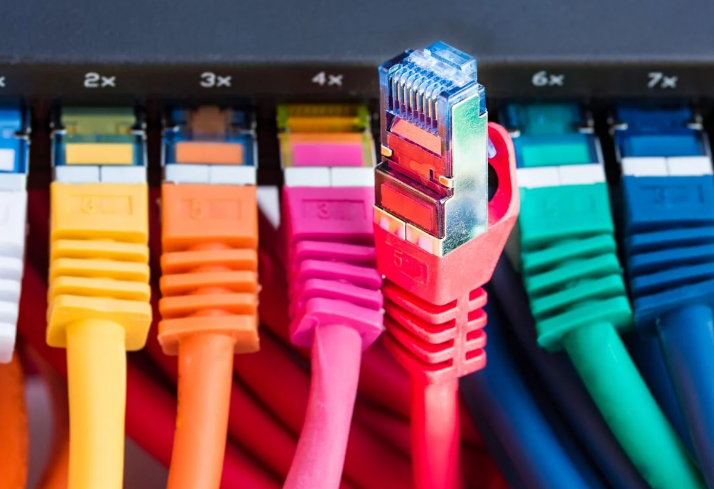{width=450}

*   **Función**: 
    Es la capa más baja del modelo OSI y se ocupa de la transmisión y recepción del flujo de bits sin procesar a través de un medio de comunicación físico. Esta capa no interpreta los bits; su única función es convertirlos en señales y enviarlos, o recibir señales y convertirlas de nuevo en bits.

 

*   **Detalles**: Esta capa se define por las características eléctricas, mecánicas y funcionales del hardware de red. 

    - **Especificaciones Físicas:** Define las características del medio físico, como:
      - Los tipos de cable (par trenzado UTP, coaxial, fibra óptica)
      - Los conectores (RJ-45)
      - Las propiedades eléctricas (niveles de voltaje)
      - Las especificaciones mecánicas (forma de los conectores).
    - **Transmisión de Bits:** Su función principal es convertir las tramas de la Capa de Enlace de Datos en un patrón de unos y ceros (bits) y transmitirlos como señales a través del medio. Estas señales pueden ser:
      - Eléctricas (a través de cables de cobre)
      - Pulsos de luz (a través de fibra óptica) 
      - Ondas de radio (en comunicaciones inalámbricas).
    - **Velocidad de Datos:** Define la velocidad de transmisión, es decir, cuántos bits por segundo se pueden enviar a través del medio.   

 

* **Ejemplo (Envío de correo electrónico)**
  
  En la etapa final del viaje descendente, la trama que contiene el fragmento de nuestro correo electrónico se convierte en una secuencia de bits (unos y ceros). 
  La tarjeta de red del ordenador emisor toma estos bits y los codifica en señales: pulsos eléctricos si se usa un cable Ethernet, u ondas de radio si se usa Wi-Fi. 
  Estas señales viajan a través del medio físico hacia el siguiente dispositivo en la red, como un switch o un router.
  Con esto, nuestro correo electrónico ha completado su viaje descendente a través de las siete capas y está físicamente en camino hacia su destino.

 

### 1.7 Ejemplo enviando un mensaje por Whatsapp

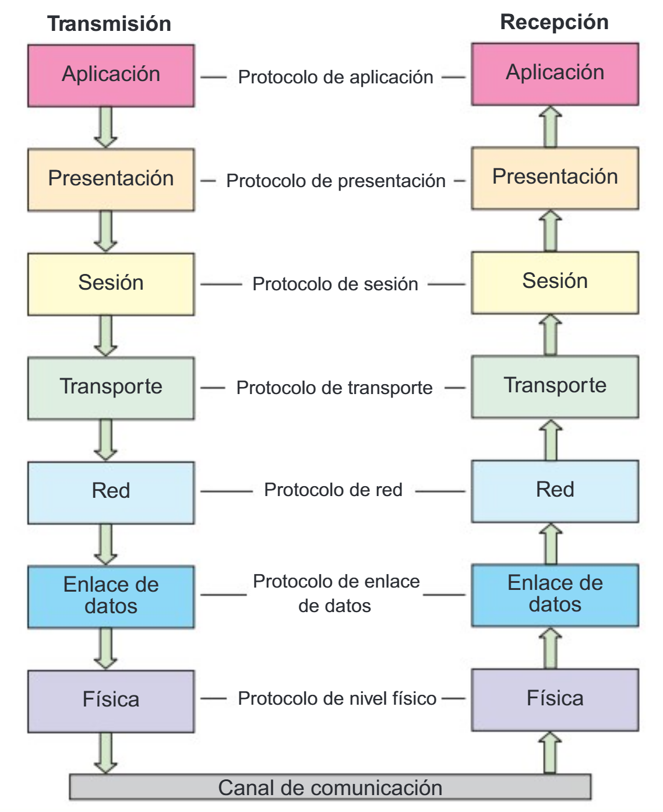{width=600}

!!! info Nota
    En este ejemplo vamos a obviar que en la comunicación por Whatsapp los mensajes pasar por un servidor. Supondremos que la comunicación es directa entre el movil origen y destino.

!!! check Envío del mensaje (Móvil emisor)
    Entras en la aplicacción WhatsApp:
    
    **7. Capa de Aplicación:** Escribes "Hola, ¿cómo estás?" en la aplicación de WhatsApp .

    **6. Capa de Presentación:** Preparación del mensaje para el envío: Se convierte el mensaje en un formato estándar de texto (por ejemplo, UTF-8), asegurándose de que los dispositivos de origen y destino puedan interpretar correctamente el contenido.

    **5. Capa de Sesión:** Se necesita establecer una conexión entre tu dispositivo y el dispositivo destino. Esta capa mantiene la sesión abierta mientras se intercambian los datos.

    **4. Capa de Transporte:** División en segmentos y control de la transmisión: Se fragmenta el mensaje en pequeños segmentos y los etiqueta con la información necesaria para que lleguen correctamente a su destino. Utiliza el protocolo TCP.

    **3. Capa de Red:** Añade la dirección IP de tu móvil y del móvil destino. Se encarga de enrutar los paquetes por las distintas redes para que lleguen a su destino correcto. Aquí los segmentos se convierten en paquetes.

    **2. Capa de Enlace de Datos:** Preparación para la transmisión física. Se añade las direcciones MAC (direcciones físicas) de tu dispositivo y del router o antena de la red a la que estás conectado. Los paquetes ahora se convierten en tramas de bits.

    **1. Capa Física:** Convierte las tramas en señales eléctricas, ópticas o de radio (dependiendo del medio de transmisión: Wi-Fi, 4G, cable Ethernet) que viajan por el medio físico (aire, cables, etc.). Aquí los datos son transmitidos en forma de bits (0s y 1s).

!!! check "Llegada al destino (Móvil receptor)"

    El mensaje viaja a través de redes intermedias, servidores y dispositivos, y finalmente llega al móvil de tu amiga. Ahora el proceso ocurre en el sentido inverso, desde la Capa Física (Capa 1) hacia la Capa de Aplicación (Capa 7).

    **1. Capa Física:** Recepción de los bits: Los bits que se **transmitieron** a través del aire o de los cables son captados por el receptor (el móvil de tu amiga) y convertidos nuevamente en tramas en la Capa Física (Capa 1).

    **2. Capa de Enlace de Datos:** Verificación de errores: las tramas se verifican para detectar posibles errores. Si todo está en orden, la información pasa a la siguiente capa.

    **3. Capa de Red:** Procesamiento de la ruta y dirección: Se asegura de que el mensaje llegó al dispositivo correcto utilizando las direcciones IP. Desempaqueta los datos y los envía hacia arriba.

    **4. Capa de Transporte:** Reensamblado de los segmentos: reagrupa las tramas en el orden correcto y verifica que no haya errores ni datos perdidos. Si falta algo, puede solicitar que se retransmitan los datos.

    **5. Capa de Sesión:** Gestión de la sesión: asegura que la comunicación continúe fluida hasta que se reciba todo el mensaje.

    **6. Capa de Presentación:** Conversión de los datos: convierte los datos del mensaje (por ejemplo, en ASCII) en texto legible para la otra persona.

    **7. Capa de Aplicación:** Visualización del mensaje: Finalmente, esta capa se encarga de mostrar el mensaje "Hola, ¿cómo estás?" en la pantalla de la aplicación de WhatsApp de tu amigo.

 

## 2. Arquitectura TCP/IP

La arquitectura TCP/IP (Transmission Control Protocol/Internet Protocol, Protocolo de control de la transmisión/Protocolo de internet) es la arquitectura más adoptada para la Interconexión de sistemas. 

### 2.1. Historia

En 1969, una agencia del departamento de defensa de Estados Unidos llamada  **"Advanced Research Projects Agency" (ARPA)**,  desarrolló una red experimental empleada en ambientes universitarios denominada **ARPANET**. 

Al principlo, esta red estaba montada sobre lineas telefonicas alquiladas; sin embargo, con el tiempo comenzaron a unirse otro tipo de redes que empleaban satélltes o enlaces de radio. El problema era que cada red utilizaba protocolos propios e incompatibles, lo que impedía una comunicación universal. 

Para resolverlo, en 1973 Vinton Cerf y Robert Kahn diseñaron una nueva arquitectura de comunicación basada en dos protocolos complementarios: **TCP**, encargado de garantizar la fiabilidad de la transmisión, e **IP**, encargado del direccionamiento y encaminamiento de los paquetes. 

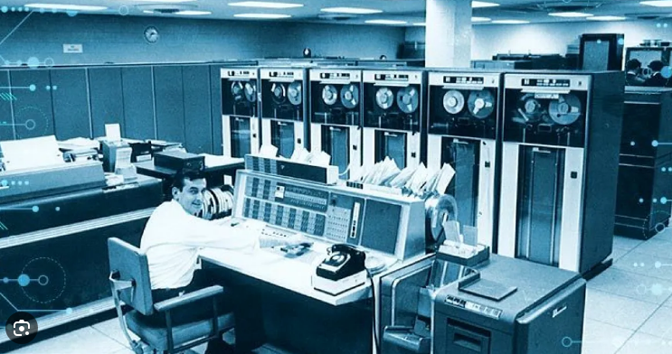{width=600}

En 1974 publicaron las bases de este modelo en un artículo pionero, y en 1978 el protocolo original se dividió formalmente en TCP e IP, quedando configurada la estructura actual. 

El 1 de enero de 1983, ARPANET adoptó oficialmente **TCP/IP**, lo que permitió unir redes distintas bajo un mismo estándar. Con ello se solucionaron los problemas de incompatibilidad, escalabilidad y robustez, sentando las bases de lo que hoy conocemos como Internet.

### 2.2 Características

La arquitectura TCP/IP representa el típico ejemplo de desarrollo tecnológico donde la **práctica prevalece sobre la teoría**. A diferencia del modelo OSI, que fue concebido como un marco teórico de referencia, TCP/IP emergió como solución concreta a problemas reales de comunicación, evolucionando desde su implementación en ARPANET hasta convertirse en el **estándar de facto para las comunicaciones globales**. Su origen tan práctica explica tanto su eficacia como algunas de sus limitaciones

La arquitectura **TCP/IP** recibe ese nombre porque se constituyó originalme por **dos protocolos clave**:

* **TCP (Transmission Control Protocol)** → se encarga de dividir los datos en segmentos, asegurar que lleguen sin errores y en orden correcto, y reensamblarlos en el destino.
* **IP (Internet Protocol)** → se encarga de direccionar y enrutar los paquetes de datos para que lleguen al destino correcto, aunque pasen por muchas redes intermedias.

#### 2.2.1. Diseño enfocado en la práctica
Hay que tener en cuenta que TCP/IP no se creó siguiendo un plan teórico perfecto, sino que nació para resolver un problema concreto: el ejército estadounidense necesitaba una red de comunicaciones que siguiera funcionando incluso si algunas de sus partes eran destruidas.

**¿Qué significa esto en la práctica?**

- **Primero lo que funciona:** En lugar de buscar el diseño teórico "perfecto" (como el modelo OSI con sus 7 capas muy definidas), los creadores de TCP/IP priorizaron que la red funcionara de manera fiable ante fallos.
- **Simplificando cuando era posible:** Si en la práctica separar algunas funciones en capas distintas complicaba demasiado las cosas o no aportaba beneficios reales, preferían juntarlas en una misma capa. Es decir, optaban por la solución simple y efectiva frente a la teóricamente "más correcta".
- **La funcionalidad por delante:** El objetivo principal era que la comunicación se mantuviera, aunque eso significara que el diseño no fuera tan puro o elegante desde un punto de vista académico.

En resumen: TCP/IP es como el mecánico experto que prefiere usar la herramienta que sabe que funciona, aunque no sea la más bonita, antes que perder tiempo con un plan teórico impecable que en la práctica no soluciona el problema. Se creó para ser útil y robusto, no para ser un modelo teórico perfecto.

#### 2.2.2. Independencia de la Tecnología Subyacente
La clave de TCP/IP está en que **no depende del tipo de conexión física que uses**. Podría decirse que es "agnóstico" respecto al medio de transmisión.

**¿Qué significa esto en la práctica?**

- **Funciona con todo:** Da igual si te conectas por cable Ethernet, fibra óptica, WiFi, 4G/5G, o incluso por satélite. TCP/IP se adapta a cualquier tecnología de red.
- **Un lenguaje común:** Gracias a la estandarización entre la capa de Internet (direcciones IP) y la capa de Acceso a la Red, diferentes tecnologías pueden comunicarse entre sí sin problemas.
- **Integración transparente:** Puedes tener una red que combine, por ejemplo, conexiones por cable en la oficina con enlaces inalámbricos para dispositivos móviles, y todo funcionará como un sistema unificado.

En esencia: TCP/IP actúa como un **traductor universal** que permite entenderse a tecnologías muy diferentes, haciendo posible que Internet sea tan diversa y accesible desde cualquier tipo de dispositivo y conexión.

#### 2.2.3. Comunicación por Conmutación de Paquetes
Este principio consiste en dividir la información en bloques pequeños llamados paquetes, que viajan de forma independiente por la red hasta su destino.

**Funcionamiento básico:**

- **Fragmentación:** Cuando envías un archivo o mensaje grande, TCP/IP lo divide en porciones más manejables (paquetes)
- **Rutas independientes:** Cada paquete puede tomar caminos diferentes a través de la red según la disponibilidad de los enlaces
- **Reensamblaje:** En el destino, todos los paquetes se vuelven a unir para reconstruir la información original

**Ventajas clave:**

- **Uso eficiente:** La red puede aprovechar mejor las conexiones disponibles
- **Robustez:** Si una ruta falla, los paquetes pueden desviarse por caminos alternativos
- **Flexibilidad:** Múltiples comunicaciones pueden compartir los mismos enlaces de forma simultánea

Es similar a enviar un documento largo por correo dividido en varias cartas que pueden llegar por rutas diferentes, pero que al final se reúnen para formar el documento completo.

#### 2.2.4. Protocolos Abiertos y Estandarizados
TCP/IP se basa en especificaciones técnicas que son públicas y accesibles para todos. Esto significa que cualquier fabricante o desarrollador puede consultar cómo funcionan estos protocolos y crear sus propios productos compatibles.

**Características principales:**

- **Documentación pública:** Las especificaciones técnicas (conocidas como RFC) están disponibles para que cualquiera las estudie y utilice
- **Estándares comunes:** Existe un conjunto de reglas bien definidas que todos siguen
- **Sin restricciones:** No hay que pagar licencias ni pedir permisos para implementar estos protocolos

**Ventajas que ofrece:**

- **Compatibilidad universal:** Dispositivos de diferentes marcas pueden comunicarse sin problemas
- **Adopción generalizada:** Al ser abierto, todo el mundo puede usarlo, lo que favorece su expansión
- **Interoperabilidad:** Sistemas muy distintos pueden trabajar juntos porque siguen las mismas normas

**Estándares**:

- Los estándares de **TCP/IP** se publican en una serie de documentos denominados **Requests for Comments (RFC)**, o **Solicitudes de Comentarios**.

- Su objetivo principal es **proporcionar información** o **describir el estado de desarrollo** de un protocolo o tecnología.

- Aunque en un principio no fueron creados para servir como estándares, **muchos RFC han sido aceptados posteriormente como tales** y constituyen la base del funcionamiento de Internet.

- 📖 Puedes consultar los RFC en el sitio oficial del IETF:
👉 [https://www.rfc-editor.org/](https://www.rfc-editor.org/)

- Un ejemplo muy conocido es el **RFC 791**, que define el protocolo IP:
👉 [RFC 791 - Internet Protocol](https://www.rfc-editor.org/rfc/rfc791)

**En esencia**, es como si las reglas de TCP/IP fueran un "libro de instrucciones" que todo el mundo puede leer y usar libremente, garantizando que todos hablemos el mismo lenguaje en Internet.

#### 2.2.5. Escalabilidad
La escalabilidad de TCP/IP significa que está diseñado para poder crecer de forma casi ilimitada sin que la red deje de funcionar correctamente.

**¿Cómo lo consigue?**

- **Direccionamiento organizado:** Las direcciones IP se asignan de forma jerárquica, como un sistema de códigos postales que permite localizar dispositivos de manera eficiente
- **Enrutamiento escalonado:** Los routers trabajan en niveles, desde redes locales hasta troncales principales, distribuyendo el tráfico de forma ordenada
- **Expansión progresiva:** Se pueden añadir nuevas redes y dispositivos sin necesidad de cambiar toda la estructura existente

**El resultado práctico:**
Esta característica es lo que ha permitido que Internet pase de conectar unos pocos ordenadores a interconectar miles de millones de dispositivos en todo el mundo, manteniendo la capacidad de seguir creciendo en el futuro.

### 2.3. Limitaciones y Problemáticas

#### 2.3.1. Agotamiento del Espacio de Direcciones IPv4
Las direcciones IPv4 usan un sistema de 32 bits, lo que permite crear aproximadamente 4.300 millones de direcciones únicas.

**¿Por qué esto es un problema?**
- Hoy existen muchos más dispositivos conectados (móviles, tablets, ordenadores, IoT) que direcciones disponibles
- Es como si tuviéramos 4.300 millones de números de teléfono para todo el mundo, pero hay más personas y dispositivos que necesitan teléfono

**Soluciones que se han aplicado:**

- **NAT (Traducción de Direcciones de Red)**
  - Es como tener un "conmutador" en una oficina: todos comparten un número principal
  - Varios dispositivos en una red local usan una sola dirección IP pública
  - Solución temporal pero muy extendida

- **Migración a IPv6**
  - La solución definitiva: IPv6 usa 128 bits, lo que permite direcciones prácticamente ilimitadas
  - Es como pasar de tener 4.300 millones de números de teléfono a tener tantos que no se acabarían nunca

- **Situación actual:**
  - Seguimos usando ambas soluciones: NAT para aliviar la falta de IPv4, mientras avanzamos hacia IPv6
  - Es un proceso lento porque requiere actualizar equipos y redes

#### 2.3.2. Falta de Separación de Responsabilidades entre capas
En el modelo TCP/IP, las tres capas superiores del modelo OSI (Aplicación, Presentación y Sesión) se agrupan en una sola capa: la capa de aplicación.

**¿Qué significa esto en la práctica?**

- **Menos especialización:** En lugar de tener capas separadas para funciones específicas, todo se gestiona dentro de la misma capa de aplicación
- **Mayor carga para las aplicaciones:** Los programas deben encargarse de tareas que en OSI estarían repartidas, como:
  - El formato de los datos (función de presentación)
  - El control de diálogo y sesiones (función de sesión)
- **Posibles solapamientos:** Diferentes aplicaciones pueden implementar las mismas funcionalidades de maneras distintas

**Consecuencia:**
Esta simplificación hace que TCP/IP sea más práctico, pero también puede generar cierta confusión sobre qué parte corresponde a la aplicación y qué parte al protocolo, ya que los límites no están tan bien definidos como en el modelo OSI.

#### 2.3.3. Seguridad no Integrada Originalmente
Cuando se creó TCP/IP, la seguridad no era una prioridad en el diseño inicial. Esto significa que los protocolos básicos no incluían protecciones incorporadas.

**¿Qué problemas genera esto?**

- **Datos viajan "en claro":** Inicialmente, la información se transmitía sin cifrar, como si se enviara una postal por correo que cualquiera puede leer
- **Sin verificación de identidad:** No había mecanismos para asegurar quién estaba realmente al otro lado de la comunicación
- **Falta de protección integral:** Cada aplicación o servicio tenía que buscar sus propias soluciones de seguridad

**Soluciones que se añadieron después:**

- **IPsec:** Protege la comunicación entre dispositivos a nivel de red (Tunel cifrado de las VPN)
- **TLS/SSL:** El famoso "candado" que cifra nuestras conexiones web y de aplicaciones
- **Sistemas de autenticación:** Métodos para verificar la identidad de usuarios y dispositivos

En esencia, la seguridad en TCP/IP llegó como "parches" posteriores, en lugar de estar integrada desde el principio en el diseño.

### 2.4. Las Cuatro Capas del Modelo TCP/IP

La arquitectura del modelo TCP/IP se organiza en una estructura de **cuatro capas**: 
- Aplicación
- Transporte
- Internet 
- Acceso a la Red 

Se trata de un modelo de capas similar al que tiene el modelo OSI.

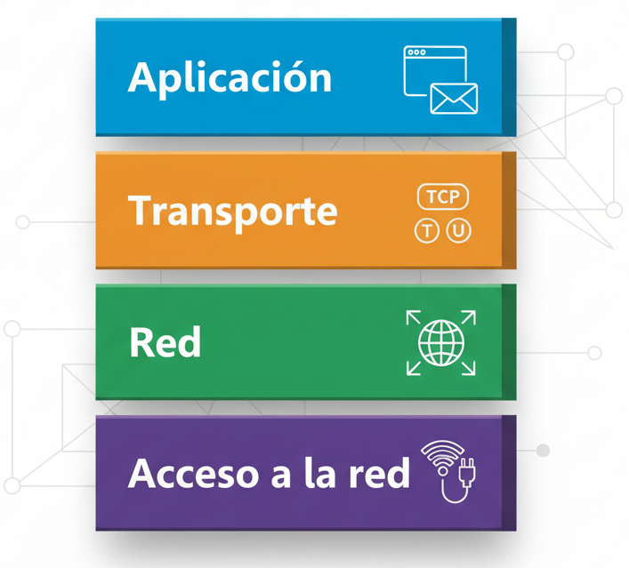{width=500}

 

#### CAPA 4. CAPA DE APLICACIÓN

Esta capa proporciona servicios directamente a las aplicaciones del usuario, permitiendo que programas en diferentes dispositivos se comuniquen entre sí.

Los protocolos clave que operan en esta capa son:

  * **HTTP** (Hypertext Transfer Protocol): para la navegación web.
  * **SMTP** (Simple Mail Transfer Protocol): para enviar correos electrónicos.
  * **FTP** (File Transfer Protocol): para transferir archivos.
  * **DNS** (Domain Name System): para resolver nombres de dominio en direcciones IP.
  
  **Ejemplo de Protocolo:** El protocolo HTTP se utiliza cuando un navegador web solicita una página a un servidor para poder mostrarla al usuario.

 

#### CAPA 3. CAPA DE TRANSPORTE

La función principal de esta capa es gestionar la conexión de extremo a extremo entre dos dispositivos y asegurar la integridad de los datos. Oculta los detalles complejos de la red a las capas superiores y ofrece dos modos principales de transmisión:

**Protocolos Clave**
  * **TCP** (Transmission Control Protocol)
  * **UDP** (User Datagram Protocol)

Dos de los protocolos más importantes de la Capa de Transporte son TCP y UDP, cada uno con un enfoque diferente para la transmisión de datos.

  | Característica             | TCP                                      | UDP                                                      |
  |---------------------------|------------------------------------------|----------------------------------------------------------|
  | Confiabilidad             | Confiable                                | No confiable                                             |
  | Orientación a la conexión | Sí (establece conexión antes de enviar)  | No (envía datos sin conexión previa)                     |
  | Caso de uso típico        | Correo electrónico, transferencia de archivos | Streaming de video, juegos en línea             |

 

!!! check **El protocolo TCP (Transmission Control Protocol) - El Metódico y Precavido**
  
    ¿Por qué se dice que TCP es un protocolo **confiable**?. Por lo siguientes motivos:

    1.  **Confirmación de Recepción:** Por cada segmento de datos que envía el receptor, el destinatario le devuelve un "¡Recibido!" (ACK). Si el emisor envía un paquete y no recibe el "ACK" después de un tiempo, lo reenvía automáticamente.
    2.  **Control de Flujo:** Regula la velocidad de envío para no saturar al receptor.
    3.  **Control de Secuencia:** Numera cada segmento para que, si llegan desordenados, el receptor sepa cómo reensamblarlos en el orden correcto.
    4.  **Control de Congestión:** Detecta cuándo la red está saturada y reduce automáticamente la velocidad de envío para evitar colapsos.
    
    En resumen, TCP es confiable porque:
    - ✅ Garantiza que **todos** los datos lleguen
    - ✅ Garantiza que lleguen **en orden**
    - ✅ Se adapta a las condiciones de la red

    >En TCP la unidades de información que se manejan se denominan **segmentos** que están numerados para poder ordenarlos en el destino.

    ¿Porqué se dice que TCP es un protocolo **orientado a conexión**?

    TCP es **orientado a conexión** porque antes de enviar datos establece un “acuerdo” entre los dos equipos. Para saber **qué aplicación** debe recibir esos datos, se usan los **puertos** (por ejemplo, el 80 para webs o el 25 para correo).
    Durante la comunicación, TCP se asegura de que la información llegue **entera, en orden y sin pérdidas**, y al terminar se **cierra la conexión de forma ordenada**.

 

!!! check **El protocolo UDP (User Datagram Protocol) - El Rápido y Directo**
    ¿Por qué se dice que UDP **NO es confiable**?
    1.  **Sin Confirmación:** Envía los datos en trozos (datagramas) y "cruza los dedos". No espera un "¡Recibido!" (ACK) del destinatario. Si un paquete se pierde por el camino, **nadie se da cuenta y no se reenvía.**
    2.  **Sin Control de Orden:** Los trozos pueden llegar en cualquier orden, y el receptor debe manejar esta situación
    3.  **Sin Control de Flujo o Congestión:** Va a toda velocidad, sin importar si el receptor puede procesar los datos o si la red está congestionada.

    En resumen, UDP NO es confiable porque:
    - ❌ **No garantiza** que todos los datos lleguen
    - ❌ **No garantiza** que lleguen en orden
    - ❌ **No se adapta** a las condiciones de la red

    >En UDP la unidades de información que se manejan se denominan **datagramos** que no están numerados. Cada datagrama es independiente y autónomo, no tiene relación con el anterior datagrama ni el siguiente.

    ¿Entonces por qué se usa UDP? ¡Porque es **MUY RÁPIDO**!

    Ejemplos de uso perfectos para UDP:
    - **Videollamadas y Streaming:** Preferimos perder algún datagrama (un pequeño pixelado) antes que sufrir retrasos.
    - **Juegos Online:** La velocidad es crítica. Es mejor saber rápidamente dónde está un jugador, aunque se pierda alguna actualización.

 

!!! check **Comparativa TPC vs. UDP**

    | Característica | TCP (El Precavido) | UDP (El Veloz) |
    |----------------|-------------------|----------------|
    | **Fiabilidad** | ✅ Alta | ❌ Baja |
    | **Velocidad** | ⚠️ Moderada | ✅ Muy Alta |
    | **Control de Flujo** | ✅ Sí | ❌ No |
    | **Reenvío de Paquetes** | ✅ Sí | ❌ No |
    | **Conexión** | ✅ Orientado a conexión | ❌ Sin conexión |

    **Conclusión:** No es que uno sea "mejor" que el otro. Son **herramientas diferentes para necesidades diferentes**. ¿Necesitas garantías? Usa TCP. ¿Necesitas velocidad? Usa UDP.

 

#### CAPA 2. CAPA DE INTERNET
  
La capa de Internet es responsable del direccionamiento lógico y el enrutamiento de paquetes de datos a través de múltiples redes. Su función principal es determinar la mejor ruta que deben seguir los datos desde su origen hasta su destino final, utilizando dispositivos llamados **routers** para redirigir los paquetes. Los protocolos más importantes son:
  * **IP (Internet Protocol)**: Es el protocolo más importante de esta capa. Gestiona las direcciones IP, que actúan como la "dirección postal" de cada dispositivo en la red.
  * **ICMP (Internet Control Message Protocol)**: Utilizado para enviar mensajes de error y de control.
  * **OSPF (Open Shortest Path First):** Un protocolo de enrutamiento utilizado para encontrar la mejor ruta para los paquetes.

 

#### CAPA 1. CAPA DE ACCESO A LA RED.

Esta capa gestiona la conexión física del dispositivo a la red. Se encarga de traducir las direcciones IP lógicas a direcciones físicas (direcciones MAC) y de empaquetar los datos en tramas para su transmisión a través de un medio físico, ya sea un cable de red o una señal inalámbrica. 

Los protocolos y estándares comunes incluyen:
  * **ARP** (Address Resolution Protocol): Realiza la traducción de direcciones IP a direcciones MAC.
  * **Ethernet** (IEEE 802.3): Estándar para redes cableadas locales.
  * **Wi-Fi** (IEEE 802.11): Estándar para redes inalámbricas locales.
  * **PPP**(Point-to-Point Protocol): Utilizado para conexiones directas entre dos nodos.

* **Ejemplo de Protocolo**: Ethernet gestiona cómo se transmiten las tramas de datos entre dos dispositivos conectados al mismo segmento de red local, como una computadora y un router en una oficina.

### 2.5. Comparativa Modelo TCP/IP vs. Modelo OSI

Al analizar la arquitectura de redes, es común encontrar una comparación entre el modelo TCP/IP y el modelo OSI. Sus filosofías de diseño son fundamentalmente distintas. 

**TCP/IP es un modelo práctico** que fue diseñado e implementado a partir de un proyecto real (ARPANET) en la década de 1970. Su enfoque se basa en protocolos específicos que demostraron su eficacia en redes operativas. 

En contraste, el **modelo OSI es un modelo de referencia teórico** y más detallado, compuesto por siete capas. Fue desarrollado como un estándar académico para explicar y comprender los conceptos de comunicación en red, pero no se implementa directamente en la práctica.

!!! check La conclusión clave es que TCP/IP es el modelo que se utiliza en la práctica para el funcionamiento de Internet y la gran mayoría de las redes modernas, mientras que el modelo OSI sirve principalmente como una herramienta conceptual y educativa.

### 2.6. Equivalencia de Capas: OSI vs. TCP/IP

La siguiente imagen muestra cómo las siete capas teóricas del modelo OSI se corresponden con las cuatro capas prácticas del modelo TCP/IP.

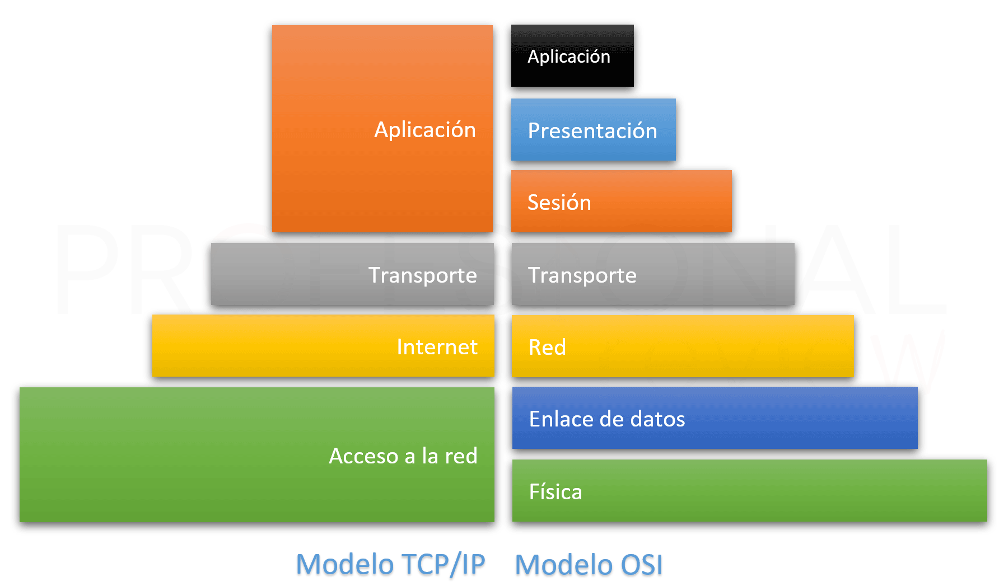{width=700}

A continuación podemos ver las equivalencia entre las capas de OSI y TCP en formato tabla

| **Modelo OSI (7 Capas)**         | **Modelo TCP/IP (4 Capas)**     | **Función Principal**                                               |
|----------------------------------|----------------------------------|----------------------------------------------------------------------|
| Capa 7: Aplicación               | Capa de Aplicación               | Interacción con el usuario y aplicaciones, formato de datos.        |
| Capa 6: Presentación             | Capa de Aplicación               | Interacción con el usuario y aplicaciones, formato de datos.        |
| Capa 5: Sesión                   | Capa de Aplicación               | Interacción con el usuario y aplicaciones, formato de datos.        |
| Capa 4: Transporte               | Capa de Transporte               | Transferencia de datos (TCP/UDP).                         |
| Capa 3: Red                      | Capa de Internet                 | Enrutamiento y direccionamiento de datos (IP).                      |
| Capa 2: Enlace de Datos          | Capa de Acceso a la Red          | Direcciones físicas (MAC) y control de acceso al medio.             |
| Capa 1: Física                   | Capa de Acceso a la Red          | Direcciones físicas (MAC) y control de acceso al medio.             |

El modelo de referencla OSI y la arquitectura TCP/IP presentan ciertas similitudes y diferencias. 

**Similitudes:**

- Ambos describen una arquitectura jerárquica en capas o niveles.
- La funcionalidad de las capas guarda cierta correspondencia.

**Diferencias**

- El modelo OSI se fundamenta en los conceptos de servicios, interfaces y protocolos, mientras que en TCP/IP se obvian.
- El modelo OSI oculta mejor los protocolos presentando una mayor modularidad e independencia.
- El modelo OSI se desarrolló con anterioridad al desarrollo de sus protocolos, mientras que en el caso de TCP/IP primero se implementaron los protocolos y posteriormente surgió el modelo, que no era más que una descripción de estos. Es decir, el modelo OSI llegó al mercado demasiado tarde para poder convertirse realmente en un standard.
- La cantidad de capas definidas es diferente en ambos modelos.
- En el nivel de transporte de TCP/IP se permiten comunicaciones orientadas a la conexion y no orientadas a la conexion, mientras que en OSI solo se permiten comunicaciones orientadas a la conexion en este nivel.
- En el nivel de red de TCP/IP solo se permiten comunicaciones no orientadas a la conexion, mientras que en este nivel del modelo OSI se permiten ambos tipos.

### 2.7. Conclusión: La Relevancia Práctica de la Arquitectura TCP/IP

En resumen, el modelo TCP/IP no es solo un concepto teórico, sino el motor funcional que impulsa la comunicación digital global. Su enfoque práctico y su arquitectura modular en cuatro capas —Aplicación, Transporte, Internet y Acceso a la Red— han demostrado ser la clave de la escalabilidad, resiliencia y éxito de Internet. Desde el envío de un correo electrónico hasta la navegación por una página web, cada acción en la red se rige por los protocolos y la estructura definidos en este modelo.

Por lo tanto, comprender el funcionamiento de estas cuatro capas, la interacción entre sus protocolos y el proceso de encapsulación es esencial para cualquier profesional que busque dominar los fundamentos sobre los que operan las redes del mundo real y la comunicación digital moderna.
