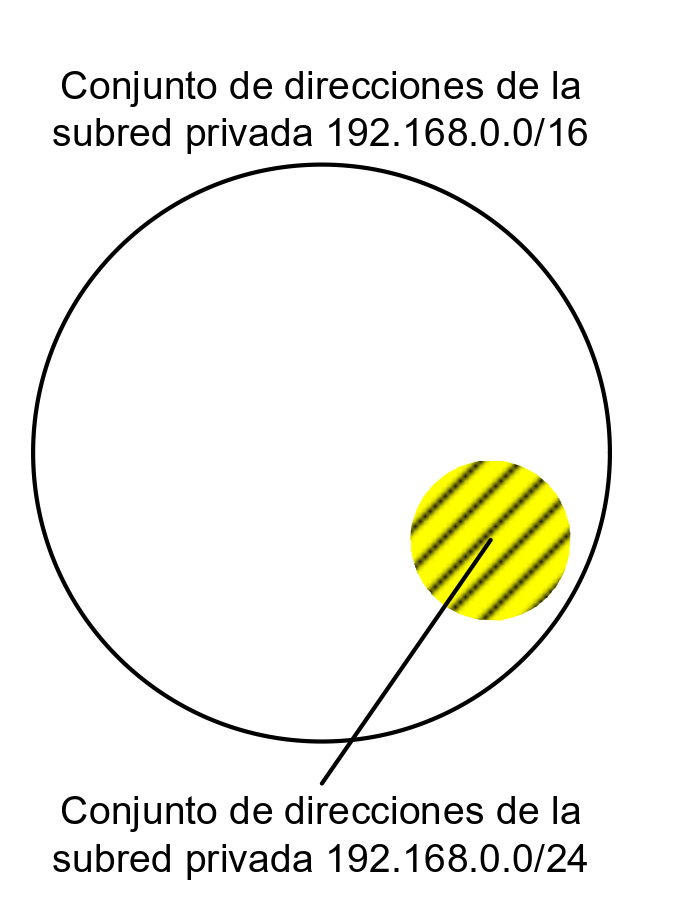
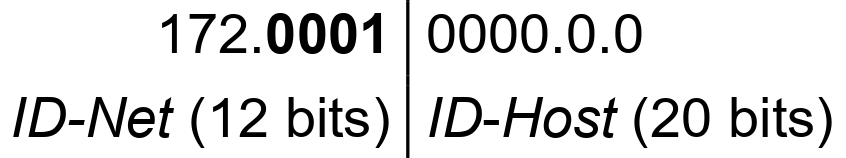
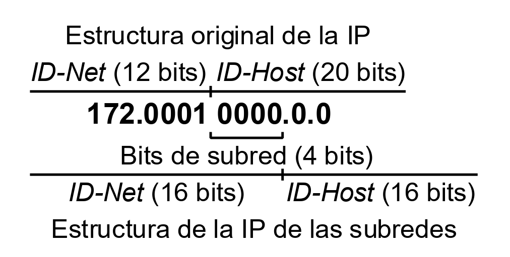
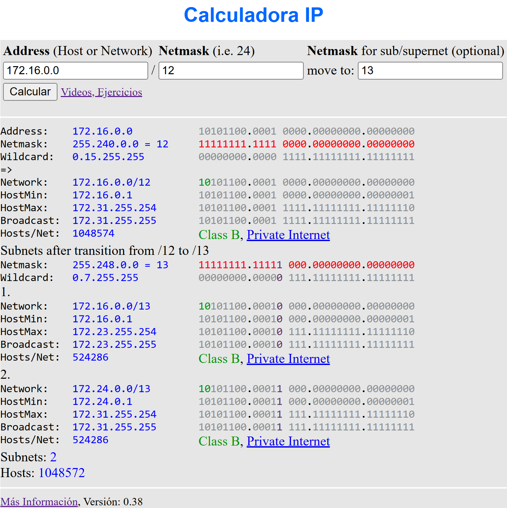
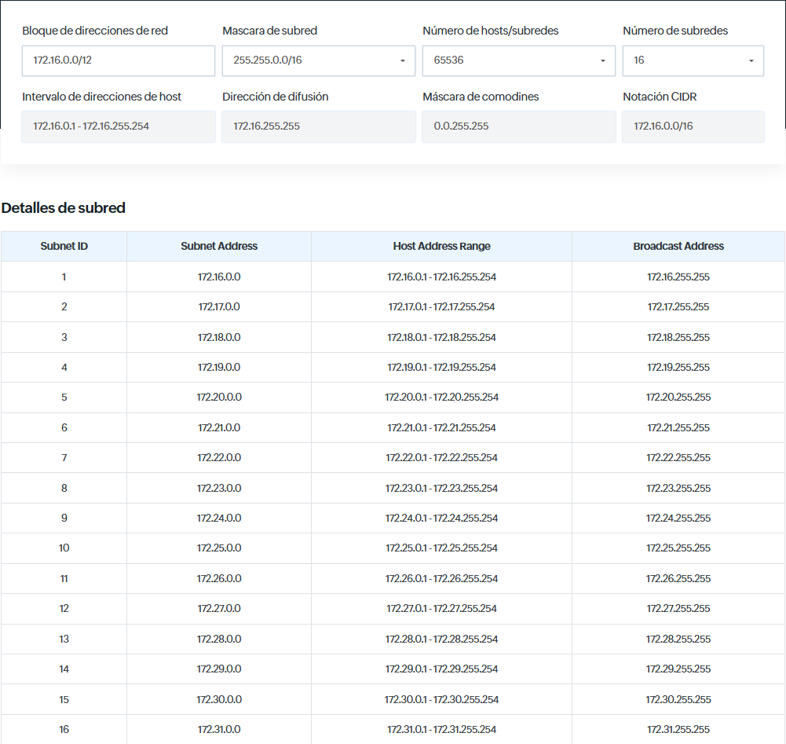

# Subnetting

- [Subnetting](#subnetting)
  - [1. Introducción](#1-introducción)
  - [2. Comprender el subnetting mediante un ejemplo](#2-comprender-el-subnetting-mediante-un-ejemplo)
    - [2.1. Obtención de las subredes](#21-obtención-de-las-subredes)
    - [2.2. Proceso de subnetting](#22-proceso-de-subnetting)
    - [2.3. Resultado final](#23-resultado-final)
  - [3. Calculadoras de subnetting en línea](#3-calculadoras-de-subnetting-en-línea)
    - [3.1. Calculadora IP (aprendaredes.com)](#31-calculadora-ip-aprendaredescom)
    - [3.2. Calculadora de subred IPv4 (Site24x7.com)](#32-calculadora-de-subred-ipv4-site24x7com)
    - [3.3. Herramientas en sistemas GNU/Linux](#33-herramientas-en-sistemas-gnulinux)
  - [4. Origen y evolución del subnetting](#4-origen-y-evolución-del-subnetting)

## 1. Introducción
Una operación muy habitual al trabajar con **direccionamiento IPv4** es la **obtención de subredes** a partir de una red dada. Este proceso permite dividir un espacio de direccionamiento plano en partes más pequeñas y manejables, conocidas como *subredes*.

En otras palabras, crear subredes consiste en **definir distintos subconjuntos de direcciones IP** dentro del conjunto original. Esto puede verse de forma ilustrativa en la imagen siguiente, donde la subred `192.168.0.0/24` se muestra como una parte del espacio total de la red `192.168.0.0/16`.

{width=300}

 

## 2. Comprender el subnetting mediante un ejemplo

Para comprender el proceso, partiremos del ejemplo de la red privada **172.16.0.0/12**.

El primer paso consiste en analizar la estructura de la dirección IP con la que vamos a trabajar.

Al tener un **prefijo de longitud 12 bits**, la **máscara de subred** correspondiente indica cómo se dividen las partes del ID de red (ID-Net) y del ID de host (ID-Host).

{width=400}

En el cuadro anterior puede observarse esta división: los **4 bits más significativos del segundo octeto** (en binario) pertenecen al ID-Net, mientras que los 4 bits restantes de ese mismo byte forman parte del ID-Host.

Pues de lo que se trata es de obtener tantas subredes, como se necesiten, partiendo de esa estructura, teniendo muy presente 
que la configuración actual de la parte del ID-Net es intocable, de manera que **el conjunto de bits que forman el ID-Net del cuadro anterior no se puede cambiar**.

 

### 2.1. Obtención de las subredes

Supongamos que se desea obtener **16 subredes** a partir de la red **172.16.0.0/12**.

Para ello, debemos determinar el **número mínimo de bits** necesarios para codificar esas subredes distintas.

El cálculo se realiza mediante la fórmula de las **variaciones con repetición**, que determina el número de combinaciones posibles de subredes en función de los bits utilizados:

**N = 2n**

Donde:

* **N** → número total de subredes posibles
* **n** → número de bits tomados (prestados) del ID-Host para formar subredes

Nosotros queremos obtener 16 subredes así que, debemos buscar un número de bits (n) tal que 2n = 16. La solución será **n=4**. Ya que:

**2n = 16** → **n = 4**

Esto significa que con 4 bits pueden generarse **16 combinaciones binarias diferentes**, y por tanto **16 subredes posibles**.

Al aplicar la fórmula, hemos comprobado que se requieren **4 bits** para representar las **16 subredes** necesarias.

 

### 2.2. Proceso de subnetting

El siguiente paso consiste en realizar la **operación de subnetting**, que implica **tomar bits de la parte del ID-Host** y **añadirlos al ID-Net**.
En este caso, se incorporan **4 bits** del ID-Host al ID-Net, respetando siempre los bits originales del ID-Net de la red base.

En la siguiente tabla se muestra el resultado de esta operación:

{width=450}

* El ID-Net pasa a ocupar 16 bits.
* El ID-Host queda también con 6 bits.
* La longitud del prefijo aumenta de /12 a /16.
* La máscara de subred cambia de `255.240.0.0` a `255.255.0.0`.

 

### 2.3. Resultado final

A partir de este proceso, se pueden definir las **subredes resultantes**, que quedan recogidas en la siguiente tabla:

| **Subred** | **Bits de subred**   | **IP de subred** | **Rango de IP de la subred**   | **Rango de IP de equipos**     |
| :--------: | :------------------- | :--------------- | :----------------------------- | :----------------------------- |
|      0     | 172.0001**0000**.0.0 | 172.16.0.0/16    | 172.16.0.0 a 172.16.255.255/16 | 172.16.0.1 a 172.16.255.254/16 |
|      1     | 172.0001**0001**.0.0 | 172.17.0.0/16    | 172.17.0.0 a 172.17.255.255/16 | 172.17.0.1 a 172.17.255.254/16 |
|      2     | 172.0001**0010**.0.0 | 172.18.0.0/16    | 172.18.0.0 a 172.18.255.255/16 | 172.18.0.1 a 172.18.255.254/16 |
|      3     | 172.0001**0011**.0.0 | 172.19.0.0/16    | 172.19.0.0 a 172.19.255.255/16 | 172.19.0.1 a 172.19.255.254/16 |
|      4     | 172.0001**0100**.0.0 | 172.20.0.0/16    | 172.20.0.0 a 172.20.255.255/16 | 172.20.0.1 a 172.20.255.254/16 |
|      5     | 172.0001**0101**.0.0 | 172.21.0.0/16    | 172.21.0.0 a 172.21.255.255/16 | 172.21.0.1 a 172.21.255.254/16 |
|      6     | 172.0001**0110**.0.0 | 172.22.0.0/16    | 172.22.0.0 a 172.22.255.255/16 | 172.22.0.1 a 172.22.255.254/16 |
|      7     | 172.0001**0111**.0.0 | 172.23.0.0/16    | 172.23.0.0 a 172.23.255.255/16 | 172.23.0.1 a 172.23.255.254/16 |
|      8     | 172.0001**1000**.0.0 | 172.24.0.0/16    | 172.24.0.0 a 172.24.255.255/16 | 172.24.0.1 a 172.24.255.254/16 |
|      9     | 172.0001**1001**.0.0 | 172.25.0.0/16    | 172.25.0.0 a 172.25.255.255/16 | 172.25.0.1 a 172.25.255.254/16 |
|     10     | 172.0001**1010**.0.0 | 172.26.0.0/16    | 172.26.0.0 a 172.26.255.255/16 | 172.26.0.1 a 172.26.255.254/16 |
|     11     | 172.0001**1011**.0.0 | 172.27.0.0/16    | 172.27.0.0 a 172.27.255.255/16 | 172.27.0.1 a 172.27.255.254/16 |
|     12     | 172.0001**1100**.0.0 | 172.28.0.0/16    | 172.28.0.0 a 172.28.255.255/16 | 172.28.0.1 a 172.28.255.254/16 |
|     13     | 172.0001**1101**.0.0 | 172.29.0.0/16    | 172.29.0.0 a 172.29.255.255/16 | 172.29.0.1 a 172.29.255.254/16 |
|     14     | 172.0001**1110**.0.0 | 172.30.0.0/16    | 172.30.0.0 a 172.30.255.255/16 | 172.30.0.1 a 172.30.255.254/16 |
|     15     | 172.0001**1111**.0.0 | 172.31.0.0/16    | 172.31.0.0 a 172.31.255.255/16 | 172.31.0.1 a 172.31.255.254/16 |

Se ha conseguido el objetivo propuesto: **definir 16 subredes dentro de la red 172.16.0.0/12**.
Cada una de estas subredes constituye un subconjunto de la red original y todas son **disjuntas**, es decir, no se solapan entre sí.

Todas las subredes generadas son **subredes privadas**, ya que están dentro del rango reservados para uso interno en redes locales.

 

## 3. Calculadoras de subnetting en línea

En Internet existen numerosas herramientas que facilitan los cálculos de subnetting. Algunas de las más útiles son:

### 3.1. Calculadora IP (aprendaredes.com)

- Permite calcular todas las subredes a partir de una red base y una nueva máscara.
- Ofrece información detallada de la red original y de las subredes generadas, tanto en formato binario como decimal.
- Disponible en:
👉 [aprendaredes.com](https://aprendaredes.com/cgi-bin/ipcalc/ipcalc_cgi1)

A continuación se muestra una captura de esta calculadora, donde se parte de la red 172.16.0.0/12 y se obtienen las dos subredes posibles al aplicar una máscara de 13 bits.

{width=800}

 

### 3.2. Calculadora de subred IPv4 (Site24x7.com)

- Realiza cálculos de subred a partir del bloque de direcciones, la máscara de red y el número máximo de hosts por subred.
- Determina automáticamente la dirección de difusión, la subred, la máscara de comodines Cisco y el rango de hosts resultante.
- Disponible en:
👉 [Site24x7.com](https://www.site24x7.com/es/tools/ipv4-subredes-calculadora.html)

A continuación se muestra una captura de esta calculadora, donde se parte de la red 172.16.0.0/12 y se obtienen un total de 16 subredes (el mismo ejemplo que hemos hecho anteriormente).

 

### 3.3. Herramientas en sistemas GNU/Linux

En sistemas **GNU/Linux** también existen utilidades que permiten realizar estos cálculos de forma automática. Algunas de las más conocidas son:

* **IPcalc** → [https://www.linux.com/topic/networking/how-calculate-network-addresses-ipcalc/](https://www.linux.com/topic/networking/how-calculate-network-addresses-ipcalc/)

* **Sipcalc** → [https://www.redhat.com/sysadmin/how-use-sipcalc](https://www.redhat.com/sysadmin/how-use-sipcalc)

* **Subnetcalc** → [https://www.uni-due.de/~be0001/subnetcalc/](https://www.uni-due.de/~be0001/subnetcalc/)

 

## 4. Origen y evolución del subnetting

El **subnetting** fue definido en el **RFC 950 (1985)**.
En este documento se recomendaba, por motivos de compatibilidad con equipos antiguos, **no utilizar**:

* La **subred 0**, cuyo identificador está formado por todos ceros.
* La **subred 15**, cuyo identificador está formado por todos unos.

Según estas recomendaciones, en el ejemplo actual no deberían usarse las subredes **0 y 15**, ya que cumplen esas condiciones.

En **1995** se publicó el **RFC 1878**, que declaró **obsoleta la restricción** del uso de las subredes con todos ceros o todos unos.
Desde entonces, salvo en casos donde exista hardware muy antiguo, **no hay impedimento técnico** para utilizar dichas subredes.

Aun así, algunos autores siguen recomendando **mantener las restricciones del RFC 950**, como medida de precaución o por motivos de compatibilidad.

Optar por seguir uno u otro estándar tiene consecuencias importantes.
Por ejemplo, si se decide cumplir el **RFC 950**, sería necesario **usar 5 bits** para las subredes.
Con 4 bits no se podrían emplear ni la subred 0 ni la 15, lo que dejaría solo 14 subredes válidas.

Esto implicaría:

 * Desperdiciar parte del espacio disponible (ya que 25 = 32 subredes posibles).
* Reducir significativamente el número de **hosts por subred**, al dedicar más bits al identificador de red.

